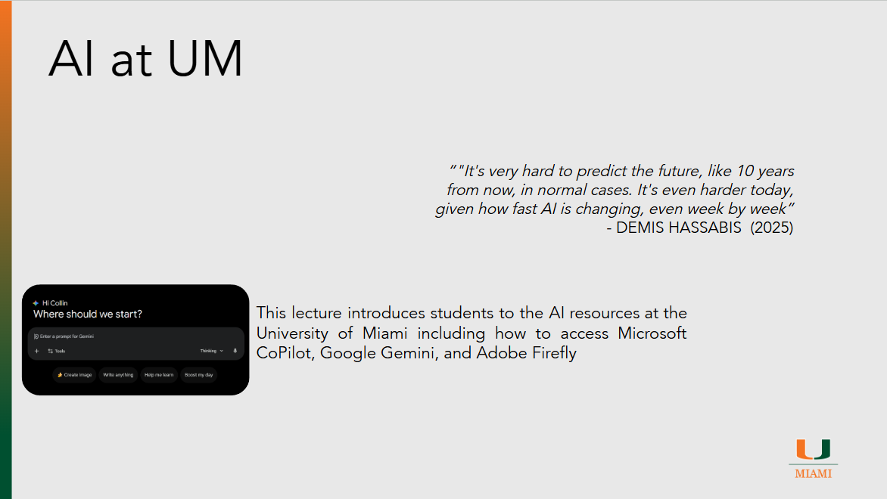

# AI at UM

??? slides "Lecture Slides"
    

      <iframe
        src ="https://docs.google.com/file/d/1oXjaCJa_EWeoPm4Kj0dZIMu2lK-ff-ON/preview" 
        style="position:absolute;top:0;left:0;width:100%;height:100%;border:0;"
        allow="autoplay"
        allowfullscreen>
      </iframe>
    

    [Download the slides (PPTX)](assets/slides/episode002.pptx)

??? recording "Lecture recording"
    

      <!-- YouTube example -->
      
Coming Soon

      <!-- 
        <iframe
          src="https://www.youtube.com/embed/VIDEO_ID"
          title="Lecture 1 Recording"
          style="width:100%; height:100%; border:0;"
          allow="accelerometer; autoplay; clipboard-write; encrypted-media; gyroscope; picture-in-picture; web-share"
          allowfullscreen>
        </iframe>
      -->
    

    <!-- Or Google Drive video:
    <iframe src="https://drive.google.com/file/d/DRIVE_VIDEO_ID/preview"
            style="width:100%; height:600px; border:0;" allow="autoplay" allowfullscreen></iframe>
    -->

??? homework "HW problems"
    # Episode 002 Homework Problems

    ## 002.1: Known vs. Approved AI Tools

    **Background:**  
    The university classifies AI tools based on risk, data governance, and academic integrity considerations. Some tools are widely used and recognized as “known,” but are not approved for general academic use, while others are officially approved and supported by the university.

    **Instructions:**  
    Select one AI tool classified as a “known” tool by the university (for example, ChatGPT) and one university-approved AI tool (such as Microsoft Copilot, Google Gemini, NotebookLM, or Adobe Firefly). Create two to three neutral prompts and submit the same prompts to both tools. Compare the responses in terms of quality, clarity, tone, transparency, and any visible safeguards or warnings.

    Prepare a short report that includes:

      - The tools selected and why you chose them  
      - The prompts used  
      - A comparison of the outputs  
      - An explanation of why the university may classify one tool as “known” rather than “approved”  

    Include screenshots of the prompts and outputs where applicable.

    ---

    ## 002.2: Investigating a Banned AI Tool

    **Background:**  
    Some AI tools are explicitly banned by the university due to heightened risks related to data privacy, security, licensing, or academic integrity. Understanding these risks is critical for responsible AI use in an academic environment.

    **Instructions:**  
    Select one AI tool listed as “banned” by the university. Conduct research only on the tool; do not use or interact with it. Investigate what the tool does, who operates it, how it handles user data, and the risks it may pose in an academic setting.

    Prepare a short report that includes:

      - A brief overview of the tool and its advertised capabilities  
      - Identified risks or concerns (e.g., privacy, security, academic misconduct)  
      - A reasoned explanation for why the university may have chosen to ban the tool  

    Support your analysis with credible sources and include citations where appropriate.

    ---

    ## 002.3: Comparing University-Approved AI Tools

    **Background:**  
    The university provides access to several approved AI tools—Microsoft Copilot, Google Gemini, NotebookLM, and Adobe Firefly—each designed for different types of tasks and use cases. Understanding the strengths and limitations of each tool helps you choose the most appropriate AI resource for a given academic or professional task.

    **Instructions:**  
    Review and use each of the university-approved AI tools: Microsoft Copilot, Google Gemini, NotebookLM, and Adobe Firefly. Explore the core features and intended use cases of each tool, focusing on how they support learning, research, content creation, and productivity.

    Prepare a short report that includes:

      - A brief description of the primary features of each tool  
      - A comparison of how each tool handles tasks such as writing assistance, research support, summarization, or content creation  
      - Specific examples of scenarios where you would choose one tool over the others (you may not use the examples provided—come up with your own)  
      - A reflection on how using the correct tool can improve efficiency while staying within university AI usage policies  

    Include screenshots demonstrating key features or example interactions with each tool where applicable.

    ---

    ## 002.4: Data Privacy and AI Tools

    **Background:**  
    AI tools differ significantly in how they collect, store, and use user data. The university evaluates these practices when determining whether a tool is approved, known but not approved, or banned, with student data privacy and regulatory compliance being key considerations.

    **Instructions:**  
    Select one university-approved AI tool, one “known” but not approved AI tool, and one banned AI tool. Review the publicly available privacy policy and terms of use for each tool. Analyze what information the tool collects, how user inputs and outputs may be logged or retained, and whether data may be shared with third parties or used for model training.

    Prepare a short report that includes:

      - A brief summary of each tool and its classification (approved, known, or banned)  
      - The types of data you provide to the tool (e.g., prompts, files, metadata, account information)  
      - What data may be logged, stored, reused, or shared according to the privacy policy  
      - A comparison of privacy risks across the three tools  
      - Practical steps a student can take to improve their privacy when using AI tools (e.g., data minimization, anonymization, tool selection)

    Support your analysis with citations to the privacy policies reviewed and include screenshots or excerpts where applicable.

??? references "References"
    - [Athens Innovation Summit 2025](https://www.youtube.com/watch?v=RmZlMYmWlJU)
    - [University of Miami AI](https://ai.it.miami.edu/)
    - [University of Miami Approved AI Tools](https://ai.it.miami.edu/ai-tools/index.html)
    - [University of Miami Known AI Tools](https://ai.it.miami.edu/ai-tools/known-ai-tools/index.html)
    - [University of Miami AI Projects](https://ai.it.miami.edu/ai-projects/index.html)
    - [University of Miami Library Resources](https://guides.library.miami.edu/newspapers)
    - [Microsoft CoPilot](https://copilot.microsoft.com/)
    - [Google Gemini](https://gemini.google.com/)
    - [NotebookLM](https://notebooklm.google.com/)
    - [Adobe Firefly](https://firefly.adobe.com/)

