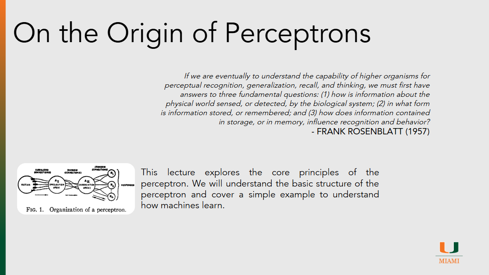

# On the Orgin of Perceptrons

??? slides "Lecture Slides"
    

      <iframe
        src ="https://docs.google.com/file/d/1WG-dVNldC33PtoX-QTQDc8yYIILHoufr/preview" 
        style="position:absolute;top:0;left:0;width:100%;height:100%;border:0;"
        allow="autoplay"
        allowfullscreen>
      </iframe>
    

    [Download the slides (PPTX)](assets/slides/episode021.pptx)

??? recording "Lecture recording"
    

      <!-- YouTube example -->
      
Coming Soon

      <!-- 
        <iframe
          src="https://www.youtube.com/embed/VIDEO_ID"
          title="Lecture 1 Recording"
          style="width:100%; height:100%; border:0;"
          allow="accelerometer; autoplay; clipboard-write; encrypted-media; gyroscope; picture-in-picture; web-share"
          allowfullscreen>
        </iframe>
      -->
    

    <!-- Or Google Drive video:
    <iframe src="https://drive.google.com/file/d/DRIVE_VIDEO_ID/preview"
            style="width:100%; height:600px; border:0;" allow="autoplay" allowfullscreen></iframe>
    -->

??? homework "HW problems"
    # Episode 02.1 Homework Problems

    ## 021.1: Parameters in a Single Perceptron

    **Background:**
    The perceptron is one of the earliest models of an artificial neuron and consists of inputs, weights, a bias term, an activation function, and an output. In class, we examined the Logical AND perceptron as a concrete example and discussed the choices that must be made when defining a perceptron model. 

    **Instructions:**
    Using the Logical AND perceptron example discussed in lecture as your starting point, investigate how the number of parameters in a single perceptron changes as the size of the input increases.

    Prepare a short report that addresses the following:

    - Identify all of the parameters that must be chosen in the Logical AND perceptron example (e.g., weights, bias, activation-related choices)
    - State how many input values the Logical AND perceptron uses and how many total parameters this requires
    - Analyze what changes when the perceptron input size increases from 2 inputs to 3 inputs
    - Extend this analysis to input sizes of 5 inputs and 10 inputs
    - Describe how the total number of parameters grows as a function of the number of inputs
    - Define a formula that expresses the total number of parameters ( y ) as a function of the input size ( x )

    Your explanation should clearly connect each step back to the structure of a single perceptron and use concrete examples where appropriate.

    ---

    ## 021.2: Exploring Activation Functions

    **Background:**
    Activation functions determine how a perceptron or neural network transforms input signals into outputs. They introduce nonlinearity into the model, allowing neural networks to represent more complex relationships. Different activation functions have different mathematical properties that affect learning behavior and model performance.

    **Instructions:**
    Review the activation functions listed on the Wikipedia page for Activation Functions:
    [https://en.wikipedia.org/wiki/Activation_function](https://en.wikipedia.org/wiki/Activation_function)

    Select three different activation functions from the list. Using a graphing calculator such as Desmos ([https://www.desmos.com/calculator](https://www.desmos.com/calculator)), plot each activation function. You may copy and paste the function definitions directly into Desmos.

    Prepare a short report that addresses the following:

    - Identify the three activation functions you selected
    - Include a plot of each activation function over a reasonable input range (for example, (x = -5) to (x = 5))
    - Describe what makes each activation function mathematically and visually different from the others
    - Discuss how each activation function behaves for large positive and large negative input values
    - Explain why one activation function might be chosen over another in a neural network
    - Reflect on how the choice of activation function can influence learning and model behavior

    ---

    ## 021.3: Logical OR with a Single Perceptron

    **Background:**
    In lecture, we used a single perceptron to model the Logical AND function by defining inputs, initializing weights and a bias, computing the weighted sum, applying an activation function, and then using an error-correction update when the perceptron produced an incorrect output. In this problem, you will repeat that process for the Logical OR function and perform one explicit learning update. 

    **Instructions:**
    Logical OR (inclusive OR) outputs `1` when at least one input is `1`, and outputs `0` only when both inputs are `0`. A truth-table hint is available in the semantics section of the Logical Disjunction article. [Wikipedia](https://en.wikipedia.org/wiki/Logical_disjunction)

    Prepare a short report that addresses the following:

    - Draw the truth table for Logical OR with inputs ((0,0), (0,1), (1,0), (1,1)) and the corresponding outputs
    - Draw a perceptron diagram like the one used in class (two inputs, two weights, a bias term, and an activation function) 
    - Initialize the perceptron with (w_1 = 0), (w_2 = 0), and (b = 0)
    - For each input pair ((0,0)), ((0,1)), ((1,0)), and ((1,1)), show the full forward-pass calculations:

      - the weighted sum (including the bias)
      - the activation output (your predicted output) Use the >0 activation function from the lecture.
    - Identify one input case where the perceptron’s predicted output is incorrect relative to your truth table
    - Using the same error-correction approach shown in class, perform one update step using a learning rate of (0.1):

      - compute the error term (target − prediction) for your chosen incorrect case
      - show the updated values of (w_1), (w_2), and (b) after the update
    - Briefly explain (2–4 sentences) why the update moved the perceptron in the direction of the correct Logical OR behavior

    ## 021.4: Logical XOR with a Single Perceptron

    **Background:**
    In lecture, we trained a single perceptron using an error-correction update rule on simple Boolean functions. Some Boolean functions (like AND and OR) are linearly separable and can be represented by a single perceptron. Others, like XOR, expose a fundamental limitation of single-layer perceptrons and motivated later developments in neural networks. 

    **Instructions:**
    Logical XOR outputs `1` when the two inputs are different and outputs `0` when the two inputs are the same. (A truth-table reference is available on Wikipedia.)

    Prepare a short report that addresses the following:

    - Draw the truth table for Logical XOR with inputs ((0,0), (0,1), (1,0), (1,1)) and the corresponding outputs ([XOR](https://en.wikipedia.org/wiki/Exclusive_or))
    - Draw a perceptron diagram like the one used in class (two inputs, two weights, a bias term, and an activation function) 
    - Initialize the perceptron with (w_1 = 0), (w_2 = 0), and (b = 0)
    - For each input pair ((0,0)), ((0,1)), ((1,0)), and ((1,1)), show the full forward-pass calculations:

      - the weighted sum (including the bias)
      - the activation output (your predicted output)
    - Identify one input case where the perceptron’s predicted output is incorrect relative to your truth table
    - Using the same error-correction approach shown in class, perform one update step using a learning rate of (0.1):

      - compute the error term (target − prediction) for your chosen incorrect case
      - show the updated values of (w_1), (w_2), and (b) after the update
    - After performing your update, briefly discuss whether you believe a single perceptron can learn XOR perfectly. Support your claim by referencing what you observed and what XOR requires geometrically (i.e., whether the classes can be separated by a single straight line). 
   

??? references "References"
    - [On the Origin of Species](https://en.wikipedia.org/wiki/On_the_Origin_of_Species)
    - [The Perceptron](https://homepages.math.uic.edu/~lreyzin/papers/rosenblatt58.pdf)
    - [Logical Conjunction](https://en.wikipedia.org/wiki/Logical_conjunction)
    - [Activation Functions](https://en.wikipedia.org/wiki/Activation_function)
    - [Perceptrons (book)](https://en.wikipedia.org/wiki/Perceptron)
    - [Michael Nielsen Perceptron Overview](http://neuralnetworksanddeeplearning.com/chap1.html#perceptrons)
