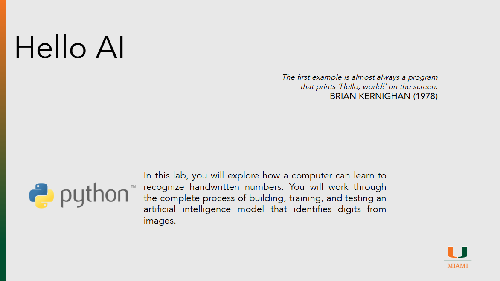

# Hello AI

??? slides "Lecture Slides"
    

      <iframe
        src ="https://docs.google.com/file/d/12ibT1HghnrcxPyJYq_D73lI4Y82HWONI/preview"
        style="position:absolute;top:0;left:0;width:100%;height:100%;border:0;"
        allow="autoplay"
        allowfullscreen>
      </iframe>
    

    [Download the slides (PPTX)](assets/slides/episode024.pptx)

??? recording "Lecture recording"
    

      <!-- YouTube example -->
      
Coming Soon

      <!-- 
        <iframe
          src="https://www.youtube.com/embed/VIDEO_ID"
          title="Lecture 1 Recording"
          style="width:100%; height:100%; border:0;"
          allow="accelerometer; autoplay; clipboard-write; encrypted-media; gyroscope; picture-in-picture; web-share"
          allowfullscreen>
        </iframe>
      -->
    

    <!-- Or Google Drive video:
    <iframe src="https://drive.google.com/file/d/DRIVE_VIDEO_ID/preview"
            style="width:100%; height:600px; border:0;" allow="autoplay" allowfullscreen></iframe>
    -->

??? homework "HW problems"
    # Episode 02.4 Homework Problems

    ## 024.1: Network Architecture and Learning Behaviour in Digit Recognition

    **Background:**
    Neural networks learn by adjusting internal parameters across layers of connected neurons. The number of hidden layers and the number of neurons in each layer affect both what the model can learn and how quickly it learns. In this lab, you will modify the architecture of a handwritten digit recognition model and observe how learning behavior changes.

    The model uses randomly initialized weights, so results may vary slightly between runs even when using the same architecture.

    **Instructions:**
    Open and run the provided notebook:

    [DigitRecognitionLab.ipynb](https://colab.research.google.com/drive/1mcGhSiEXrl_oUuF85GqW1pjmwXVsk08G?usp=sharing)

    Using the existing code, modify **only**:

    * The number of hidden layers, and
    * The number of neurons in each hidden layer
    * Number of Training Epochs

    Do not change the dataset, training procedure, or any other parameters (See the notes in the Notebook on how to modify the code).

    Prepare a short report that addresses the following.

    ---

    ### Part A: Architecture Exploration

    For at least **four different architectures**, record:

    | Hidden Layers | Neurons per Layer |  Total Parameters |Overall test accuracy   | Training Epochs | Notes |
    | ------------- | ----------------- | ----------------- | ---------------------- | --------------- | ----- |
    |               |                   |                   |                        |                 |       |
    |               |                   |                   |                        |                 |       |
    |               |                   |                   |                        |                 |       |
    |               |                   |                   |                        |                 |       |

    Include screenshots showing:

    * The network architecture
    * The final accuracy

    ---

    ### Reflection Questions

    In your report, answer the following:

    * Did increasing the number of layers and neurons reduce the number of epochs required to learn?
    * Did adding complexity always improve performance?
    * Why might a larger network learn faster—or slower—than a smaller one?
    * Why might you want to use a smaller network?

    ---

    ## 024.2: Testing the Model With Your Own Handwritten Digits

    **Background:**
    Handwritten digit recognition models are often trained on large datasets collected under controlled conditions. When tested on new handwriting styles, model performance may vary depending on stroke thickness, shape, spacing, and overall consistency.

    In this lab, you will test the trained model using your own handwritten digits and evaluate how well it generalizes.

    **Instructions:**
    Using the instructions provided in the notebook:

    1. Write the digits 0 through 9 on a blank sheet of paper
    2. Take clear photos or scans of each digit
    3. Crop each image so that only one digit is visible
    4. Upload the images to the notebook and run the prediction code (Make sure to follow the instructions in the Notebook on how to name the files correctly)

    Prepare a short report that addresses the following.

    ---

    ### Prediction Results

    Record whether the model correctly predicted each digit.

    | Digit | Model Prediction | Correct? (Yes/No) | Notes |
    | ----- | ---------------- | ----------------- | ----- |
    | 0     |                  |                   |       |
    | 1     |                  |                   |       |
    | 2     |                  |                   |       |
    | 3     |                  |                   |       |
    | 4     |                  |                   |       |
    | 5     |                  |                   |       |
    | 6     |                  |                   |       |
    | 7     |                  |                   |       |
    | 8     |                  |                   |       |
    | 9     |                  |                   |       |

    In your report, address the following questions:

    * Which digits were predicted correctly? Which were incorrect?
    * How does your handwriting differ from the digits in the training dataset?

    Include screenshots showing:

    * Your uploaded digit images
    * The model’s predictions

??? references "References"
    - [The C Programming Language (book)](https://en.wikipedia.org/wiki/The_C_Programming_Language)
    - [Hello AI Lab](https://colab.research.google.com/drive/1mcGhSiEXrl_oUuF85GqW1pjmwXVsk08G?usp=sharing)

