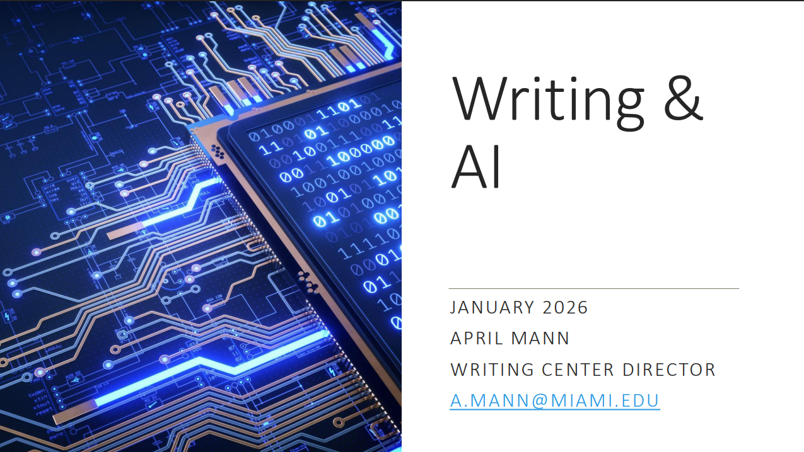

# AI For Writing

??? slides "Lecture Slides"
    See our Canvas Site for Slides

??? recording "Lecture recording"
    

      <!-- YouTube example -->
      
Coming Soon

      <!-- 
        <iframe
          src="https://www.youtube.com/embed/VIDEO_ID"
          title="Lecture 1 Recording"
          style="width:100%; height:100%; border:0;"
          allow="accelerometer; autoplay; clipboard-write; encrypted-media; gyroscope; picture-in-picture; web-share"
          allowfullscreen>
        </iframe>
      -->
    

    <!-- Or Google Drive video:
    <iframe src="https://drive.google.com/file/d/DRIVE_VIDEO_ID/preview"
            style="width:100%; height:600px; border:0;" allow="autoplay" allowfullscreen></iframe>
    -->

??? homework "HW problems"
    # Episode 03.1 Homework Problems

    ### 031.1: How Does AI “Write”?

    **Background:**
    The presentation emphasizes that AI-generated writing often has a recognizable style.

    **Instructions:**
    Read the NYT article [Why Does AI Write Like That](https://www.nytimes.com/2025/12/03/magazine/chatbot-writing-style.html) and review the relevant slides from the Writing & AI presentation.

    Prepare a short written response that addresses the following:

    * Summarize the author’s main argument about why AI writing sounds the way it does
    * Identify specific stylistic features or patterns the author claims are telltale signs of AI-generated text (for example, recurring phrases, punctuation habits, or rhetorical structures)
    * Explain the author’s discussion of overfitting and how it helps explain AI writing style
    * Describe one example from the article where AI writing imitates human language but fails to capture genuine human experience
    * Reflect on whether you agree with the author’s concern that AI writing may begin to influence how humans write. Why or why not?

    ---

    ### 031.2: Evaluating the Tradeoffs of AI Writing

    **Background:**
    AI writing tools can increase productivity and lower barriers to entry, but they also raise concerns about originality, learning, and authorship.

    **Instructions:**
    Prepare a short response that addresses the following:

    * List at least three advantages of using AI for writing
    * List at least three disadvantages of using AI for writing
    * Identify situations where the **benefits outweigh the risks**
    * Identify situations where the **risks outweigh the benefits**

    Support your answers with examples from academic, professional, or personal writing contexts.

    ---

    ### 031.3: Comparing Three Ways of Writing

    **Background:**
    The presentation raises questions about authorship, learning, and responsibility when AI is involved in writing. Different levels of AI involvement may lead to different outcomes in quality, effort, and authenticity.

    **Instructions:**
    Below are **five possible topics** related to AI ethics and the future of AI. Choose **three different topics** and complete the writing tasks described.

    **Topic options (choose any three):**

    1. AI and academic integrity
    2. AI and creativity
    3. AI bias in writing and communication
    4. AI’s impact on future jobs
    5. AI and the definition of authorship

    For each topic:

    1. **Topic A:** Write one paragraph **without using AI at all**
    2. **Topic B:** Write one paragraph using AI as an **outlining or brainstorming assistant only**
    3. **Topic C:** Have AI write the entire paragraph and copy/paste the result

    After completing all three paragraphs, answer the following:

    * Which paragraph had the highest overall quality? Why?
    * Which paragraph best reflected *your* thoughts and voice?
    * Which paragraph was easiest to create?
    * Did your answers surprise you? Explain

    ---

    ### 031.4: Why Do Professors Still Ask Students to Write?

    **Background:**
    One of the central questions in the presentation is why writing assignments still matter in an era when AI can generate text instantly.

    **Instructions:**
    Prepare a short response that addresses the following:

    * Why writing is traditionally used as a learning tool in college courses
    * What skills writing develops that AI cannot fully replace
    * How AI changes—but does not eliminate—the purpose of writing assignments

    ---

    ### 031.5: Responsible Use and Personal Boundaries

    **Background:**
    The presentation emphasizes responsible AI use, self-awareness, and aligning behavior with values rather than rules alone.

    **Instructions:**
    Prepare a short reflective response that addresses the following:

    * Identify one AI writing tool you are most likely to use
    * Describe how you would use it responsibly in an academic setting
    * Describe one situation where you would choose not to use AI, even if it were allowed
    * Propose one personal guideline you will follow when using AI for writing

??? references "References"
    - [Why Does AI Write Like That](https://www.nytimes.com/2025/12/03/magazine/chatbot-writing-style.html)
    - [ChatGPT](https://chatgpt.com/)
    - [Gemini](https://gemini.google.com)
    - [Claude](https://claude.ai/login)
    - [CoPilot](https://copilot.microsoft.com/)
    - [DeepSeek](https://www.deepseek.com/)
    - [ChatPDF](https://www.chatpdf.com/)
    - [Wordtune](https://www.wordtune.com/)
    - [Elicit](https://elicit.com/)
    - [SCISPACE](https://scispace.com/)
    - [Research Rabbit](https://www.researchrabbit.ai/)
    - [Beautiful.ai](https://www.beautiful.ai/)
    - [Slides AI](https://www.slidesai.io/)
    - [Dall-E](https://openai.com/index/dall-e-3/)
    - [Firefly](https://www.adobe.com/products/firefly)
    - [Abstract Generator](https://x.writefull.com/abstract-generator)
    - [AudioPen](https://audiopen.ai/)
    - [CocoNote](https://coconote.app/)
    - [Heuristica](https://www.heuristi.ca/)
    - [Scite](https://scite.ai/)
    - [MyLens](https://mylens.ai/)
    - [NotebookLM](https://notebooklm.google/)
    - [NapkinAI](https://www.napkin.ai/)

