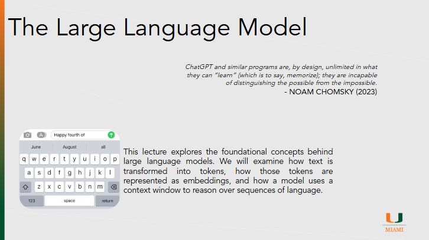

# The Large Languge Model

??? slides "Lecture Slides"
    

      <iframe
        src ="https://docs.google.com/file/d/195OkRX-t8VtvjRVJxWbmZ2yql0dmO4IR/preview"
        style="position:absolute;top:0;left:0;width:100%;height:100%;border:0;"
        allow="autoplay"
        allowfullscreen>
      </iframe>
    

    [Download the slides (PPTX)](assets/slides/episode041.pptx)

??? recording "Lecture recording"
    

      <!-- YouTube example -->
      
Coming Soon

      <!-- 
        <iframe
          src="https://www.youtube.com/embed/VIDEO_ID"
          title="Lecture 1 Recording"
          style="width:100%; height:100%; border:0;"
          allow="accelerometer; autoplay; clipboard-write; encrypted-media; gyroscope; picture-in-picture; web-share"
          allowfullscreen>
        </iframe>
      -->
    

    <!-- Or Google Drive video:
    <iframe src="https://drive.google.com/file/d/DRIVE_VIDEO_ID/preview"
            style="width:100%; height:600px; border:0;" allow="autoplay" allowfullscreen></iframe>
    -->

??? homework "HW problems"
    # Episode 04.1 Homework Problems

    ## 041.1: The Fill-in-the-Blank Game and Its Consequences

    **Background:**
    Large Language Models are trained to predict the next token in a sequence of text. In class, this idea was introduced through a “fill in the blank” game, where you were asked to guess the next word in a story based on what came before. While this seems simple, the choices you made—and *why* you made them—reveal important insights about how language models generate text and the limitations of that approach.

    **Instructions:**
    Participate in the fill-in-the-blank exercise discussed in class (for example, completing the sentence “Once upon a time…”).

    Prepare a short report that addresses the following:

    * Describe your **thought process** when deciding what the next word should be
    * Identify the factors that influenced your choice (such as grammar, common phrases, narrative expectations, or prior experience)
    * Reflect on how choosing the *most likely* next word shapes the direction of the story
    * Explain how this same process might influence the outputs of a large language model
    * Discuss one consequence—positive or negative—of generating text primarily by predicting what comes next

    ---

    ## 041.2: Attention and Why It Changed Language Models

    *(Required external resource)*

    **Background:**
    Early language models processed text in a strictly sequential way, which limited their ability to handle long or complex sentences. The introduction of the attention mechanism allowed models to dynamically focus on different parts of the input text. This idea is central to the transformer architecture and modern large language models. The 3Blue1Brown video provides an intuitive, visual explanation of how attention works.

    **Instructions:**
    Watch the following video:
    [https://www.youtube.com/watch?v=LPZh9BOjkQs](https://www.youtube.com/watch?v=LPZh9BOjkQs)

    Prepare a short report that addresses the following:

    * Explain, in your own words, what the attention mechanism does
    * Describe how attention allows a model to focus on relevant parts of a sentence rather than treating all words equally
    * Explain why attention is especially important for understanding long sentences or paragraphs
    * Reflect on how the visual explanation in the video helped you understand attention compared to a purely text-based explanation

    ## 041.3: Scale, Power, and Environmental Impact

    **Background:**
    Modern LLMs have hundreds of billions of parameters and are trained on enormous datasets using large amounts of computational power. This scale has enabled dramatic improvements in performance, but it also raises concerns about environmental impact. Importantly, the environmental cost of AI comes from both training models and inference (running the model to generate outputs).

    **Instructions:**
    Research the environmental impact of large-scale AI systems. You are encouraged to find credible sources, such as academic articles, industry reports, or reputable journalism.

    Prepare a short report that addresses the following:

    * Explain how scaling up AI models (more parameters, more data) affects energy use
    * Describe the environmental impact of training a large model
    * Describe the environmental impact of inference (using the model after it is trained)
    * Discuss whether you think the benefits of large language models justify these costs
    * Cite at least two external sources in your response

    ---

    ## 041.4: From Early NLP to Transformers

    **Background:**
    Natural Language Processing (NLP) existed long before large language models. Early systems relied on rules, statistics, and simpler neural networks. A major shift occurred with the introduction of the attention mechanism in 2014, followed by the transformer architecture in 2017, which became the foundation for modern LLMs.

    **Instructions:**
    Review the following resources:

    * Early NLP overview (example):
      [https://en.wikipedia.org/wiki/Natural_language_processing](https://en.wikipedia.org/wiki/Natural_language_processing)
    * *Neural Machine Translation by Jointly Learning to Align and Translate* (2014):
      [https://arxiv.org/abs/1409.0473](https://arxiv.org/abs/1409.0473)
    * *Attention Is All You Need* (2017):
      [https://arxiv.org/abs/1706.03762](https://arxiv.org/abs/1706.03762)

    Prepare a short report that addresses the following:

    * Describe one limitation of early NLP systems
    * Explain what problem the attention mechanism was designed to solve
    * Describe why the transformer architecture was such a significant breakthrough
    * Reflect on how these architectural changes made today’s large language models possible

    

??? references "References"
    - [Neural Machine Translation by Jointly Learning to Align and Translate](https://arxiv.org/abs/1409.0473)
    - [Attention is all you Need](https://arxiv.org/abs/1706.03762)
    - [BERT](https://arxiv.org/abs/1810.04805)
    - [VIT](https://arxiv.org/abs/2010.11929)
    - [Claude Model Paremeters](https://claude.ai/public/artifacts/0ecdfb83-807b-4481-8456-8605d48a356c)
    - [LLM Wikipedia](https://en.wikipedia.org/wiki/List_of_large_language_models)
    - [OpenAI Tokenizer](https://platform.openai.com/tokenizer)
    - [ChatGPT Tokens](https://emaggiori.com/chatgpt-all-tokens/)
    - [Projection Example](https://projector.tensorflow.org/)
    - [Summary of GPT3 Architecture](https://dugas.ch/artificial_curiosity/GPT_architecture.html)
    - [3Blue1Brown Videos on LLMs](https://www.youtube.com/watch?v=LPZh9BOjkQs&list=PLZHQObOWTQDNU6R1_67000Dx_ZCJB-3pi&index=5)

