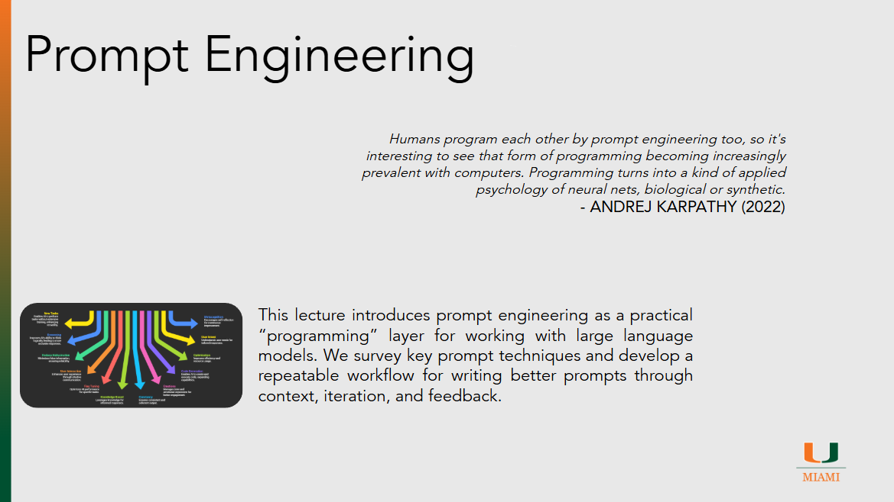

# Prompt Engineering

??? slides "Lecture Slides"
    

      <iframe
        src ="https://docs.google.com/file/d/1Gz6uBhgBpJSmfXDLVsOWG8BWiG_X_MfD/preview"
        style="position:absolute;top:0;left:0;width:100%;height:100%;border:0;"
        allow="autoplay"
        allowfullscreen>
      </iframe>
    

    [Download the slides (PPTX)](assets/slides/episode051.pptx)

??? recording "Lecture recording"
    

      <!-- YouTube example -->
      
Coming Soon

      <!-- 
        <iframe
          src="https://www.youtube.com/embed/VIDEO_ID"
          title="Lecture 1 Recording"
          style="width:100%; height:100%; border:0;"
          allow="accelerometer; autoplay; clipboard-write; encrypted-media; gyroscope; picture-in-picture; web-share"
          allowfullscreen>
        </iframe>
      -->
    

    <!-- Or Google Drive video:
    <iframe src="https://drive.google.com/file/d/DRIVE_VIDEO_ID/preview"
            style="width:100%; height:600px; border:0;" allow="autoplay" allowfullscreen></iframe>
    -->

??? homework "HW problems"
    # Episode 05.1 Homework Problems

    ## 051.1: Prompt Techniques on MMLU-Pro and Creative Writing

    **Background:**
    Prompt engineering techniques can improve performance on tasks that require reasoning, structure, tone control, and constraint-following. In this homework, you will apply multiple techniques and evaluate whether they are actually helpful. 

    **Instructions:**
    Using the prompt engineering techniques explored in class (choose from **Few Shot**, **Role Based**, **Chain of Thought (CoT)**, **Emotion Prompting**, **Code Execution**, **Rephrase and Respond (RaR)**, or **Take a Step Back**), select two techniques and apply them in two settings:

    1. **MMLU-Pro**

    * Select one question from the MMLU-Pro dataset.
    * Read the original source paper for each technique you chose so you understand how the authors used it
    * Apply the technique to the problem from the MMLU-Pro dataset
    * Bounus: Find a prompt in the MMLU-Pro data set that the model gets wrong initally but when you apply one of the techniques the model gets it correct.

    2. **Creative writing constraint task**

    * Use the same two techniques on the prompt:
      “In 200 words or less write a story about a dog who goes to the store.”

    Prepare a short report that addresses the following:

    * The two techniques you selected and a shrot summary of what they are
    * The MMLU-Pro question you used (copy/paste it into your report)
    * Your baseline prompt (no technique) and outputs
    * Your technique prompts and outputs (include screenshots of your prompts)
    * Was each technique helpful?
    * When / what types of tasks would you consider using the technique for?

    ---

    ## 051.2: More Prompt Engineering Methods

    **Background:**
    Prompt engineering is a rapidly expanding field, with many techniques beyond what can be covered in a single lecture. This assignment builds your ability to independently research and apply techniques from the literature. 

    **Instructions:**
    Pick one prompt technique from the paper *A Systematic Survey of Prompt Engineering in Large Language Models: Techniques and Applications* that we **did not** discuss in class.

    You will need to review the original source paper for the technique (see Figure 2 in the survey for pointers to original sources).

    Prepare a short report that addresses the following:

    * The technique you selected and a clear explanation of how it works
    * The original source paper you used (citation/reference) and what you learned from it
    * Two example scenarios where the technique would be helpful
    * For each scenario: the exact prompt you used, plus screenshots of your LLM conversations
    * A short evaluation: Was the technique helpful? Why or why not?

    ---

    ## 051.3: Prompt Length Experiment — Ethics of AI in Art

    **Background:**
    Small changes in prompt length and specificity can produce large changes in output quality, voice, and factual grounding. This lab explores how constraints and context shape model behavior. 

    **Instructions:**
    In three separate new chat windows, ask an LLM to write an essay on the ethics of AI in art using three prompt lengths:

    * Condition A: 5 words or less
    * Condition B: 25–50 words
    * Condition C: 100–200 words

    Prepare a short report that addresses the following:

    * Your three prompts (A/B/C) and how you changed them each time (Include screenshots of your prompts)
    * The three essays (include screenshots or pasted text or a link to your chat, as required)
    * Your observations about changes in: structure, nuance, evidence, and bias/assumptions
    * If you were an English professor, what grade would you give each essay and why?
    * Which essay best represents your views on the ethics of AI in art, and why?

    ---

    ## 051.4: Nondeterminism, Bias, and Hallucination — Fill-in-the-Blank Lab

    **Background:**
    LLMs may produce different completions to the same prompt (nondeterminism), fill missing information using assumptions (bias), or invent details when context is missing (hallucination). 

    **Instructions:**
    Run the following prompts and record outputs:

    1. “He lives in ________”
    2. “The king lives in ________”

    For each prompt, query **two different LLMs** (or the same LLM in two separate new chats), and collect at least **4 total completions** per prompt.

    Prepare a short report that addresses the following:

    * Your collected completions for each prompt
    * Examples of **nondeterminism** (different completions)
    * Examples of **bias/assumptions** (what the model assumed and why that might reflect human expectations)
    * Examples of **hallucination** (fabricated specificity)
    * A short conclusion: how adding context (“king…”) changed results

    Include screenshots of your prompts and outputs.

    ---

    ## 051.5: Grounding to Reduce Hallucinations — “Manual RAG” Comparison

    **Background:**
    One way to reduce hallucination is to provide relevant source text inside the context window (a simplified version of the idea behind Retrieval Augmented Generation, RAG). 

    **Instructions:**
    Choose a short source of truth (one):

    * A 300–800 word excerpt from a credible article you paste into the chat, or
    * A short course reading excerpt you paste into the chat

    Write **8 factual questions** that can be answered using only that excerpt.

    Run two conditions in separate new chats:

    * **Condition A (Ungrounded):** Ask the 8 questions without providing the excerpt
    * **Condition B (Grounded):** Paste the excerpt first and instruct:
      “Answer using only the provided text. If the answer is not in the text, write: ‘Not in the text.’ Quote the sentence(s) you used.”

    Prepare a short report that addresses the following:

    * The excerpt you used
    * Your 8 questions
    * A table comparing A vs B: correct / incorrect / “not in the text”
    * At least 2 examples where grounding changed the outcome (with screenshots)

    ---

    ## 051.6: Understanding User Intent — RaR vs Take-a-Step-Back

    **Background:**
    Some prompts are ambiguous and cause the model to guess the user’s intent. Techniques like **Rephrase and Respond (RaR)** and **Take a Step Back** can improve intent understanding and reduce unhelpful assumptions. 

    **Instructions:**
    Create **5 ambiguous questions** (e.g., “Should I do it?”, “Is it safe?”, “What’s the best option?”).

    For **two** of your ambiguous questions, test all three conditions in separate new chats:

    * **A. Baseline:** Ask the question as-is
    * **B. RaR:** “First rephrase my question to be more precise, then answer.”
    * **C. Take-a-Step-Back:** “Before answering, list assumptions you might be making and what you’d need to know. Then answer and clearly state your assumptions.”

    Prepare a short report that addresses the following:

    * Your ambiguous questions
    * Screenshots of A/B/C for at least **two** questions
    * Which method reduced assumptions the most?
    * Which produced the most useful answer and why?

    ---

    ## 051.7: Managing Tone — Emotion Prompting vs Neutral Prompting

    **Background:**
    Prompting can intentionally shape tone and affect the style and persuasiveness of output. Emotion prompting is one technique for steering tone. 

    **Instructions:**
    Pick one topic that can be written in multiple tones (examples: “AI in hiring,” “AI in education,” or “AI in healthcare”).

    In separate new chats, generate three versions of the same response:

    * **A. Neutral / objective tone**
    * **B. Emotion-prompted tone** (e.g., urgent, inspiring, cautious, empathetic—choose one)
    * **C. Professional memo tone** (e.g., concise and action-oriented)

    Prepare a short report that addresses the following:

    * The three prompts you used and why you wrote them that way
    * The three outputs
    * A comparison of tone, clarity, and bias/assumptions
    * Which tone is most appropriate for (1) students, (2) executives, and (3) the general public?

    Include screenshots of prompts and outputs.

    ---

    ## 051.8: Prompt Optimization — Iteration and Scoring (OPRO-Inspired)

    **Background:**
    Prompt optimization can be treated like an iterative improvement problem: you propose a prompt, evaluate the result, and revise. This aligns with the idea of optimization-by-prompting (OPRO) and structured iteration workflows like “The Intern Method.” 

    **Instructions:**
    Choose one target task:

    * A short essay, a study guide, a structured explanation, or a small coding task

    Create a rubric with **4 criteria**, each scored **0–5** (total 20). Example criteria: correctness, completeness, structure, clarity.

    Run **5 iterations**:

    * Iteration 0: baseline prompt
    * Iterations 1–4: revise your prompt to increase your rubric score
    * Each iteration must include your rubric (paste it) and you must record the score

    Prepare a short report that addresses the following:

    * Your rubric
    * Your 5 prompts (Iter 0–4)
    * Scores per iteration (table or chart)
    * What specifically you changed each iteration and why
    * Screenshots of Iter 0 and Iter 4 outputs (minimum)

    

??? references "References"
    - [System Prompt Examples](https://github.com/x1xhlo system-prompts-and-models-of-ai-tools)
    - [Google Prompt Engineering](https://www.kaggle.com/whitepaper-prompt-engineering)
    - [IBM Prompt Engineering](https://www.ibm.com/think/prompt-engineering)
    - [Microsoft Prompt Engineering](https://learn.microsoft.com/en-us/azure/ai-foundry/openai/concepts/prompt-engineering?view=foundry-classic)
    - [Claude Prompt Engineering](https://platform.claude.com/docs/en/build-with-claude/prompt-engineering/overview)
    - [LLM Prompt Library](https://github.com/abilzerian/LLM-Prompt-Library)
    - [CoPilot Prompt Gallery](https://m365.cloud.microsoft/copilot-prompts)
    - [Gemini Prompt Gallery](https://ai.google.dev/gemini-api/prompts)
    - [A Systematic Survey of Prompt Engineering in Large Language Models Techniques and Applications](https://arxiv.org/pdf/2402.07927)
    - [Retrieval-Augmented Generation for Knowledge-Intensive NLP Tasks](https://arxiv.org/abs/2005.11401)
    - [ReAct Synergizing Reasoning and Acting in Language Models](https://arxiv.org/abs/2210.03629)
    - [Chain-of-Thought Prompting Elicits Reasoning in Large Language Models](https://arxiv.org/abs/2201.11903)
    - [Active Prompting with Chain-of-Thought for Large Language Models](https://arxiv.org/html/2302.12246v5)
    - [EmotionPrompt Leveraging Psychology for Large Language Models Enhancement via Emotional Stimulus](https://arxiv.org/pdf/2307.11760v3)
    - [Chain of Code Reasoning with a Language Model-Augmented Code Emulator](https://arxiv.org/abs/2312.04474)
    - [Large Language Models as Optimizers](https://arxiv.org/pdf/2309.03409)
    - [Rephrase and Respond](https://arxiv.org/pdf/2311.04205)
    - [Take a Step Back](https://arxiv.org/pdf/2310.06117)
