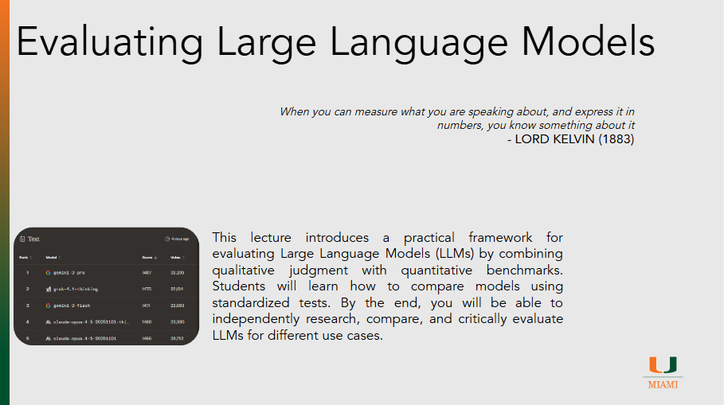

# Evaluating LLMs

??? slides "Lecture Slides"
    

      <iframe
        src ="https://docs.google.com/file/d/1trQjU8LeQoVsGoQszA2GeM3CpEr7HI-1/preview"
        style="position:absolute;top:0;left:0;width:100%;height:100%;border:0;"
        allow="autoplay"
        allowfullscreen>
      </iframe>
    

    [Download the slides (PPTX)](assets/slides/episode061.pptx)

??? recording "Lecture recording"
    

      <!-- YouTube example -->
      
Coming Soon

      <!-- 
        <iframe
          src="https://www.youtube.com/embed/VIDEO_ID"
          title="Lecture 1 Recording"
          style="width:100%; height:100%; border:0;"
          allow="accelerometer; autoplay; clipboard-write; encrypted-media; gyroscope; picture-in-picture; web-share"
          allowfullscreen>
        </iframe>
      -->
    

    <!-- Or Google Drive video:
    <iframe src="https://drive.google.com/file/d/DRIVE_VIDEO_ID/preview"
            style="width:100%; height:600px; border:0;" allow="autoplay" allowfullscreen></iframe>
    -->

??? homework "HW problems"
    # Episode 06.1 Homework Problems

    

??? references "References"
    - [LLM Arena](https://arena.ai/)
    - [Awesome AI Benchmarks and Evaluations](https://github.com/awesomelistsio/awesome-ai-benchmarks-evaluation)
    - [MMLU-Pro](https://arxiv.org/abs/2406.01574)
    - [MMLU-Pro Github](https://github.com/TIGER-AI-Lab/MMLU-Pro)
    - [MMLU-Pro Dataset](https://huggingface.co/datasets/TIGER-Lab/MMLU-Pro)
    - [vals.ai MMLU-Pro](https://www.vals.ai/benchmarks/mmlu-pro)
    - [GPQA A Graduate-Level Google-Proof Q&A Benchmark](https://arxiv.org/abs/2311.12022)
    - [GPQA Dataset](https://huggingface.co/datasets/Idavidrein/gpqa)
    - [vals.ai GPQA](https://www.vals.ai/benchmarks/gpqa)
    - [ChatGPT Pricing](https://chatgpt.com/pricing)
    - [Gemini Pricing](https://gemini.google/subscriptions/)
    - [Claude Pricing](https://claude.com/pricing)
    - [Grok Pricing](https://grok.com/plans)
    - [Kimi Pricing](https://kimik2ai.com/pricing/)
    - [Reconciling the contrasting narratives on the environmental impact of large language models](https://www.nature.com/articles/s41598-024-76682-6)
    - [HuggingFace Energy Score](https://huggingface.co/spaces/AIEnergyScore/Leaderboard)
    - [Energy and Policy Considerations for Deep Learning in NLP](https://arxiv.org/abs/1906.02243)
    - [Making AI Less Thirsty](https://dl.acm.org/doi/full/10.1145/3724499)
    - [The growing energy footprint of artificial intelligence](https://www.cell.com/joule/fulltext/S2542-4351(23)00365-3)