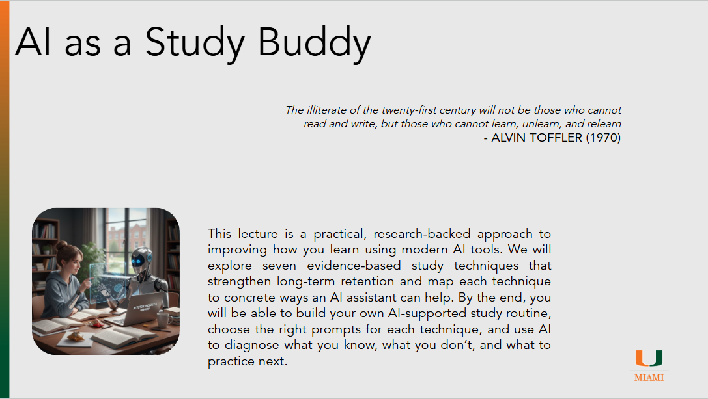

# AI as a Study Buddy

??? slides "Lecture Slides"
    

      <iframe
        src ="https://docs.google.com/file/d/1m_ErV97xOCeqGLUq-uhnbYok1RoI-nwX/preview"
        style="position:absolute;top:0;left:0;width:100%;height:100%;border:0;"
        allow="autoplay"
        allowfullscreen>
      </iframe>
    

    [Download the slides (PPTX)](assets/slides/episode071.pptx)

??? recording "Lecture recording"
    

      <!-- YouTube example -->
      
Coming Soon

      <!-- 
        <iframe
          src="https://www.youtube.com/embed/VIDEO_ID"
          title="Lecture 1 Recording"
          style="width:100%; height:100%; border:0;"
          allow="accelerometer; autoplay; clipboard-write; encrypted-media; gyroscope; picture-in-picture; web-share"
          allowfullscreen>
        </iframe>
      -->
    

    <!-- Or Google Drive video:
    <iframe src="https://drive.google.com/file/d/DRIVE_VIDEO_ID/preview"
            style="width:100%; height:600px; border:0;" allow="autoplay" allowfullscreen></iframe>
    -->

??? homework "HW problems"
    # Episode 07.1 Homework Problems
    ## 071.1: AI-assisted studying with NotebookLM
    
    **Background**:
    This assignment focuses on applying evidence-based study strategies (retrieval practice, spaced repetition, blended learning, and active learning) using NotebookLM as a study tool. Your goal is to build a realistic study plan for an upcoming test and evaluate whether NotebookLM materially improved your studying.

    **Instructions**:

    1. Choose an upcoming test in one of your current classes (any subject).

    2. Collect your study materials for that test (lecture notes, slides, textbook sections, handouts, problem sets, etc.).

    4. Use NotebookLM to create each of the following study assets for your test:
    a) quiz
    b) flashcards 
    c) short video script or “video lesson” outline 
    d) podcast-style explanation 
    e) infographic outline 

    5. For each of the 5 assets, determine whether NotebookLM was valuable and why.

    Prepare a short report that includes:

    * the 5 NotebookLM assets (or screenshots of what you created)
    * a short evaluation of each assest
    * Wich asset was most useful and why
    * Which asset was least useful and what you would do differently next time

    ---

    ## 071.2: Teach-back with an LLM (active learning)

    ** Background**:
    Teach-back is a form of active learning: you learn better when you explain an idea and get feedback on gaps, misconceptions, and missing steps. In this assignment, you will use an LLM as a “curious tutor” that challenges your explanation and helps you refine it.

    **Instructions**:

    1. Choose one topic that will be on your upcoming test (a concept you find difficult or important).

    2. Write a short “teach-back script” from memory (no notes).

    * target length: 250–400 words
    * include: definition, why it matters, and one example or application

    3. Use an LLM as a tutor to run a teach-back session:

    * paste your teach-back script
    * ask the model to respond only with questions at first (Socratic style), not explanations
    * after 6–10 questions, ask the model to diagnose your gaps and provide a corrected explanation (with structure)

    4. Revise your teach-back script one time based on the feedback.

    5. Evaluate whether the LLM improved your understanding or just improved your wording.

    Prepare a short report that includes:

    * your original teach-back script
    * the LLM questions (at least 6)
    * the gap diagnosis + corrected explanation
    * your revised script
    * a short reflection answering:
    a) what misunderstanding did the LLM reveal (if any)?
    b) what was the highest-quality question it asked?
    c) did it push you toward real understanding or just nicer writing?

    ---

    ## 071.3: Interleaving plan using an LLM (practice discrimination + reduce pattern-matching)

    **Background**:
    Interleaving means mixing problem types rather than practicing one type in a block. The goal is to train “problem recognition” (figuring out what kind of problem it is) and “strategy selection” (choosing the right method). In this assignment, you will design an interleaving schedule and measure whether it helps.

    **Instructions**:

    1. Choose a subject that includes multiple problem types (math, chemistry, physics, programming, economics, statistics, etc.).

    2. Identify 4–6 problem categories that are likely to appear on your test (for example: “acid-base titration,” “equilibrium,” “stoichiometry,” etc.).

    3. Use an LLM to help you:

    * refine your categories so they are distinct
    * generate a 7–10 day interleaving practice plan
    * generate a small set of practice prompts/questions for each category (or identify what you will use from your existing materials)

    4. Your interleaving plan must include:

    * at least 6 practice sessions
    * each session includes at least 3 different categories
    * an error log structure (fields you will record after each session)

    Prepare a short report that includes:

    * your category list (with a 1–2 sentence definition of each)
    * your interleaving plan (day-by-day)
    * your error log template
    * a short evaluation section:
    a) what category was easiest to confuse with another? why?
    b) what would you change about your plan after your first 2 sessions?

    Table to fill out:

    | Day/session | Categories mixed | Materials used (source) | Time spent | Score / accuracy | Most common error type | Next action (what you will do next time) |
    | ----------- | ---------------- | ----------------------- | ---------- | ---------------- | ---------------------- | ---------------------------------------- |
    | 1           |                  |                         |            |                  |                        |                                          |
    | 2           |                  |                         |            |                  |                        |                                          |
    | 3           |                  |                         |            |                  |                        |                                          |
    | 4           |                  |                         |            |                  |                        |                                          |
    | 5           |                  |                         |            |                  |                        |                                          |

??? references "References"
    - [CISSP Study Material GitHub](https://github.com/jefferywmoore/CISSP-Study-Resources/blob/main/CISSP-Domain-1-2024%2BObjectives.md)
    - [The critical role of retrieval practice in long-term retention](https://www.cell.com/trends/cognitive-sciences/abstract/S1364-6613(10)00208-1)
    - [Spaced education improves the retention of clinical knowledge by medical students](https://medicine.wright.edu/sites/medicine.wright.edu/files/page/attachments/Kerfoot%20etal%20spaced%20education%20retention%20knowledge%20MedEduc2007.pdf)
    - [A systematic review of interleaving as a concept learning strategy](http://bera-journals.onlinelibrary.wiley.com/doi/full/10.1002/rev3.3266)
    - [Active Learning](https://www.researchgate.net/profile/Gertrude-Hewapathirana/publication/359045593_Active_Learning_Compared_With_Lecture-Based_Pedagogies_in_Gender_and_Socio-Cultural_Context-Specific_Major_and_Non-Major_Biology_Classes/links/632975d470cc936cd31fc1f1/Active-Learning-Compared-With-Lecture-Based-Pedagogies-in-Gender-and-Socio-Cultural-Context-Specific-Major-and-Non-Major-Biology-Classes.pdf)
    - [Online Homework Put to the Test](https://pubs.acs.org/doi/full/10.1021/ed3006264?casa_token=sIEjz85EsysAAAAA%3AteACCrrsYyehg8UO6vRdfLQVbT3LEJ1_ZDNMvX0waOYL8zwT3jJ4jgPq2dyfv_uDpKMkYgFHJUvTc_U)
    - [Metacognition and learning](https://link.springer.com/article/10.1007/s11409-006-6893-0)