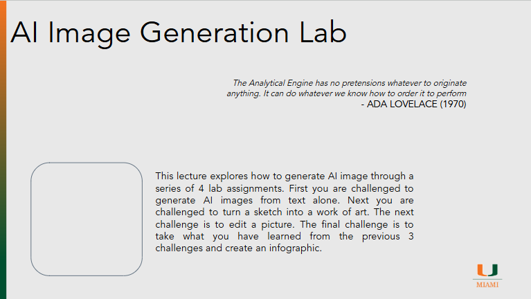

# AI Image Generation Lab

??? slides "Lecture Slides"
    

      <iframe
        src ="https://docs.google.com/file/d/1-wBJ7Q7dQsCFQdk2-JmjF6YdN0gqN4El/preview"
        style="position:absolute;top:0;left:0;width:100%;height:100%;border:0;"
        allow="autoplay"
        allowfullscreen>
      </iframe>
    

    [Download the slides (PPTX)](assets/slides/episode081.pptx)

??? recording "Lecture recording"
    

      <!-- YouTube example -->
      
Coming Soon

      <!-- 
        <iframe
          src="https://www.youtube.com/embed/VIDEO_ID"
          title="Lecture 1 Recording"
          style="width:100%; height:100%; border:0;"
          allow="accelerometer; autoplay; clipboard-write; encrypted-media; gyroscope; picture-in-picture; web-share"
          allowfullscreen>
        </iframe>
      -->
    

    <!-- Or Google Drive video:
    <iframe src="https://drive.google.com/file/d/DRIVE_VIDEO_ID/preview"
            style="width:100%; height:600px; border:0;" allow="autoplay" allowfullscreen></iframe>
    -->

??? homework "HW problems"
    # Episode 08.1 Homework Problems

??? references "References"
    - [Elliot with Tie](assets/images/ElliotInTie.jpeg)
    - [Elliot on Bed](assets/images/ElliotOnBed.jpeg)
    - [Elliot at Chair](assets/images/ElliotInChair.jpeg)
    - [Firefly](https://www.adobe.com/products/firefly)
    - [NotebookLM](https://notebooklm.google/)
    - [NapkinAI](https://www.napkin.ai/)

