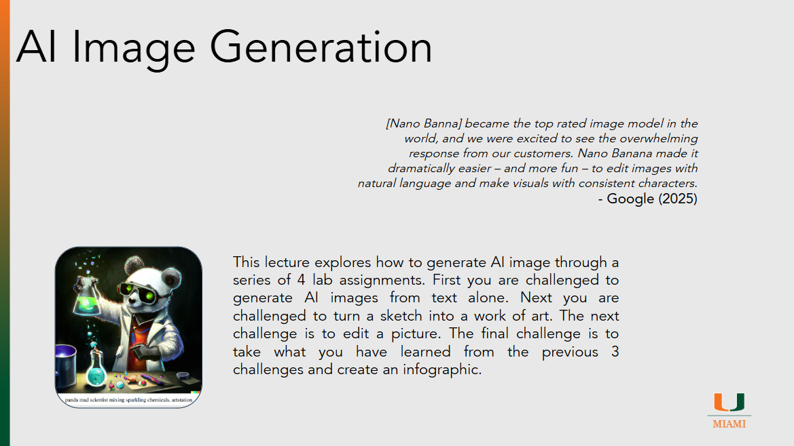

# AI Image Generation 

??? slides "Lecture Slides"
    

      <iframe
        src ="https://docs.google.com/file/d/1tgpiWXv9p4ZYMvfnB83vDsRWQiEFyb3a/preview"
        style="position:absolute;top:0;left:0;width:100%;height:100%;border:0;"
        allow="autoplay"
        allowfullscreen>
      </iframe>
    

    [Download the slides (PPTX)](assets/slides/episode091.pptx)

??? recording "Lecture recording"
    

      <!-- YouTube example -->
      
Coming Soon

      <!-- 
        <iframe
          src="https://www.youtube.com/embed/VIDEO_ID"
          title="Lecture 1 Recording"
          style="width:100%; height:100%; border:0;"
          allow="accelerometer; autoplay; clipboard-write; encrypted-media; gyroscope; picture-in-picture; web-share"
          allowfullscreen>
        </iframe>
      -->
    

    <!-- Or Google Drive video:
    <iframe src="https://drive.google.com/file/d/DRIVE_VIDEO_ID/preview"
            style="width:100%; height:600px; border:0;" allow="autoplay" allowfullscreen></iframe>
    -->

??? homework "HW problems"
    # Episode 09.1 Homework Problems

    ## 091.1: Paper Deep-Dive (PRNN, DDPM, CLIP, unCLIP, or Stable Diffusion)

    **Background:**
    Modern image generators and image–text models come from a few foundational research directions covered in lecture: autoregressive image generation (PRNN), diffusion (DDPM), image–text contrastive learning (CLIP), and diffusion+CLIP hybrids (unCLIP / Stable Diffusion).   

    **Instructions:**
    Choose one of the following papers from the lecture slides (While you should consult the orginal paper you may also wish to search for addional resources explaining the tecnique I have included some in the refrences for this episoide but you may find your own as well):

    * Pixel Recurrent Neural Networks (PRNN): [https://arxiv.org/abs/1601.06759](https://arxiv.org/abs/1601.06759) 
    * Denoising Diffusion Probabilistic Models (DDPM): [https://arxiv.org/abs/2006.11239](https://arxiv.org/abs/2006.11239) 
    * CLIP: [https://openai.com/index/clip/](https://openai.com/index/clip/) 
    * unCLIP (DALL·E 2): [https://cdn.openai.com/papers/dall-e-2.pdf](https://cdn.openai.com/papers/dall-e-2.pdf) 
    * Stable Diffusion: [https://arxiv.org/abs/2112.10752](https://arxiv.org/abs/2112.10752) 

    Prepare a short report that addresses the following:

    * In your own words, what is the core technique introduced in the paper? (Explain it like you’re teaching it to a smart friend who didn’t take this class.)
    * What problem was the technique designed to solve? What was hard about the “previous way” of doing it?
    * What are the key inputs and outputs of the technique? (Example: text→image, noisy image→clean image, image+text→scores, etc.)
    * What is one assumption the paper relies on that could break in real-world use?
    * What is one benefit and one risk of using this technique in products people actually rely on?

    **Deliverables:**

    * A 1–2 page report (bullet points are fine, but must be complete)
    * At least 2 cited references (the paper counts as 1; at least 1 additional reference—lecture, blog, docs, or explainer—is required)

    ---

    ## 091.2: Autoregressive vs. Diffusion — Model Choice Under Constraints

    **Background:**
    The lecture contrasts two major families of image generation approaches: autoregressive generation (e.g., PRNN) and diffusion generation (e.g., DDPM, and later Stable Diffusion-style systems).  

    **Instructions:**
    You are advising a small team building a “Generate an Image” feature for a student-facing app.

    Pick one model family to recommend:

    * **Autoregressive image generation** (PRNN-style) 
      OR
    * **Diffusion-based image generation** (DDPM-style) 

    Prepare a short report that addresses the following:

    * Your recommendation (autoregressive or diffusion) and a 1–2 sentence thesis for why.
    * Evaluate your choice against at least 5 constraints below (you can add your own):

      * latency / time to generate an image
      * compute cost (training + inference)
      * controllability (ability to follow constraints)
      * image quality / realism
      * diversity vs “samey outputs”
      * failure modes (nonsense images, artifacts, mode collapse-like behavior, etc.)
      * safety and misuse risk (deepfakes, disallowed content, prompt exploitation)
      * reproducibility (getting the “same” image again)

    ---

    ## 091.3: DDPM From Tutorial — Flowers → MNIST Digits (Code Modification)

    **Background:**
    DDPMs learn to generate images by (1) gradually adding noise to real images (forward process), and (2) training a model to reverse that process (denoise) step-by-step until a sample looks like data again. The LearnOpenCV tutorial walks through training a DDPM on a flowers dataset.

    **Instructions:**
    Follow this tutorial and get the code running to generate flowers:

    * LearnOpenCV DDPM tutorial: [https://learnopencv.com/denoising-diffusion-probabilistic-models/](https://learnopencv.com/denoising-diffusion-probabilistic-models/)

    Then modify the code so the model generates **MNIST digits** instead of flowers.

    **Deliverables:**

    * A short report (1–2 pages) including:

      * link to your google colab notebook
      * screenshots of flowers outputs and MNIST outputs

??? references "References"
    - [Pixel Recurrent Neural Networks](https://arxiv.org/abs/1601.06759)
    - [Algorithmic Simplicity Autoregressive](https://www.youtube.com/watch?v=zc5NTeJbk-k)
    - [Denoising Diffusion Probabilistic Models](https://arxiv.org/abs/2006.11239)
    - [Diffusion Demo](https://learnopencv.com/denoising-diffusion-probabilistic-models/)
    - [3Blue1Brown Diffusion](https://www.youtube.com/watch?v=iv-5mZ_9CPY)
    - [Denoising Diffusion Implicit Models](https://arxiv.org/abs/2010.02502)
    - [Sorush Mehraban Diffusion Models](https://www.youtube.com/watch?v=r4V0vLhYZIQ)
    - [CLIP](https://openai.com/index/clip/)
    - [unCLIP (Dalle-2) -https](https://cdn.openai.com/papers/dall-e-2.pdf)
    - [Dalle 2 Article](https://medium.com/augmented-startups/how-does-dall-e-2-work-e6d492a2667f)
    - [Open AI Dalle - https](https://openai.com/index/dall-e-2/)
    - [Stable Diffusion](https://arxiv.org/abs/2112.10752)
    - [Stable Diffusion Demo](https://stability.ai/blog/stable-diffusion-public-release)
    - [How SD works](https://stable-diffusion-art.com/how-stable-diffusion-work/#Text-to-image)

