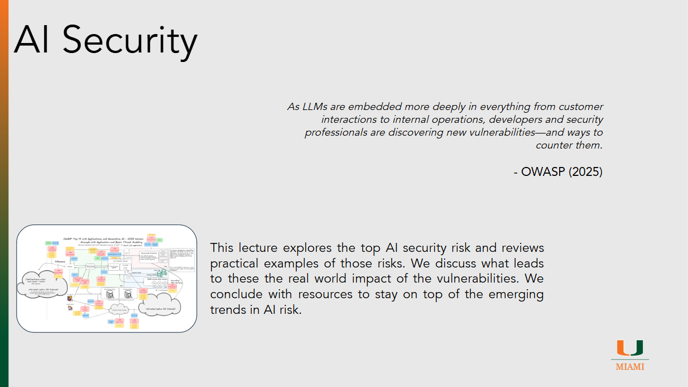

# AI Security

??? slides "Lecture Slides"
    

      <iframe
        src ="https://docs.google.com/file/d/1khPO3S7MOIp1YgaBlNYar6UFUw_FVm1o/preview"
        style="position:absolute;top:0;left:0;width:100%;height:100%;border:0;"
        allow="autoplay"
        allowfullscreen>
      </iframe>
    

    [Download the slides (PPTX)](assets/slides/episode141.pptx)

??? recording "Lecture recording"
    

      <!-- YouTube example -->
      
Coming Soon

      <!-- 
        <iframe
          src="https://www.youtube.com/embed/VIDEO_ID"
          title="Lecture 1 Recording"
          style="width:100%; height:100%; border:0;"
          allow="accelerometer; autoplay; clipboard-write; encrypted-media; gyroscope; picture-in-picture; web-share"
          allowfullscreen>
        </iframe>
      -->
    

    <!-- Or Google Drive video:
    <iframe src="https://drive.google.com/file/d/DRIVE_VIDEO_ID/preview"
            style="width:100%; height:600px; border:0;" allow="autoplay" allowfullscreen></iframe>
    -->

??? homework "HW problems"
    # Episode 15.1 Homework Problems

    ## 015.1: Real-World AI Security Incident Analysis

    **Background:**
    The OWASP Top 10 for LLM Applications identifies major categories of security risk in modern AI systems, including prompt injection, sensitive information disclosure, supply chain weaknesses, data poisoning, excessive agency, and other emerging threats. Real-world incidents help show how these risks move from theory into practice.

    **Instructions:**
    Find one real-world article describing an AI security incident, vulnerability, misuse case, or failure related to any of the attack categories discussed in class. Your article may come from a news outlet, security company, research blog, or other credible source. Then analyze the incident using the OWASP-style attack categories from the lecture.

    Prepare a short report that addresses the following:

    * Identify the article you selected and provide a full reference or link
    * Briefly summarize the incident in your own words
    * Explain which AI security attack category from the lecture the incident best fits under
    * Justify why you believe that category is the best match
    * Describe how the attack, misuse, or failure worked
    * Explain what the attacker, user, or system was trying to do
    * Discuss the real or potential impact of the incident
    * Explain what could have been done to prevent the incident or reduce its severity

    Below are 5 homework ideas for Lecture 10.1: **AI Security**, written to fit the style and level of the examples you attached. I centered them on the main risks covered in your slides—prompt injection, disclosure, supply chain, poisoning, and agency—while keeping the tasks practical and reflective rather than repetitive.  

    ---

    ## 015.2: Prompt Injection in the Real World

    **Background:**
    Prompt injection is one of the most important security risks in modern AI systems. It occurs when an attacker crafts input that changes the behavior of a model in unintended ways, either directly through user prompts or indirectly through external content such as files, webpages, or emails.

    **Instructions:**
    Review the lecture examples of direct and indirect prompt injection, including misuse of customer-facing chatbots, jailbreaks, malicious PDFs, and malicious emails. Then select **two** examples from the lecture and compare how the attack works in each case.

    Prepare a short report that addresses the following:

    * Identify the two examples you selected
    * Explain how the attack works in each case
    * Describe what the attacker is trying to achieve
    * Explain why a human user might miss the attack or fail to recognize it as malicious
    * Compare which of the two attacks you think would be more dangerous in a real organization and why
    * Propose at least **three** defenses that could reduce the risk of these attacks
    * Conclude with a short reflection on why prompt injection is difficult to solve completely

    ---

    ## 015.3: When an AI System Leaks What It Should Protect

    **Background:**
    AI systems may expose sensitive information that was not intended to be revealed. This can include personal data, confidential business information, hidden system instructions, or information from other users’ conversations or documents.

    **Instructions:**
    Choose **one** example from the lecture related to sensitive information disclosure, such as PII leakage, system prompt leakage, cross-chat data exposure, or disclosure of confidential business data. Then analyze the example as if you were a security consultant explaining the risk to a non-technical manager.

    Prepare a short report that addresses the following:

    * Summarize the example you selected
    * Describe what sensitive information could be exposed
    * Explain who could be harmed by the disclosure
    * Discuss whether the main issue is a technical flaw, a policy/governance problem, or both
    * Explain how the impact would differ if the affected organization were a university, hospital, or private company
    * Recommend at least **three** controls that could reduce the risk
    * Conclude by explaining whether you think this kind of leakage is more likely to happen because of careless use, poor system design, or malicious abuse

    ---

    ## 015.4: AI Supply Chain Risk Assessment

    **Background:**
    AI systems depend on a complex supply chain that may include models, datasets, libraries, APIs, hosted services, and third-party tools. Weaknesses in any of these components can introduce security, legal, or reliability risks.

    **Instructions:**
    Select **one** AI tool, model, framework, or AI-powered application that is publicly available. This could be a chatbot, coding assistant, image generator, model repository, AI library, or other AI-related system. Analyze it as part of an AI supply chain.

    Prepare a short report that includes:

    * The AI system you selected and a short description of what it does
    * A diagram or list showing at least **four** parts of its supply chain (for example: model provider, training data, open-source libraries, plugins, hosting provider, or external integrations)
    * Two possible security or trust risks in that supply chain
    * One possible legal, licensing, or governance risk
    * An explanation of which part of the supply chain you think is the weakest link and why
    * A short recommendation for how an organization should evaluate this system before adopting it
    * A concluding paragraph on whether organizations should treat AI supply chain review as different from traditional software supply chain review, and why

    ---

    ### 015.5: How Could an AI System Be Poisoned?

    **Background:**
    AI systems can be manipulated if training data, fine-tuning data, or related inputs are poisoned. A poisoned system may continue to appear normal while producing biased, unreliable, or harmful results under specific conditions. Understanding how such attacks could happen is important for building systems that are trustworthy and resilient.

    **Instructions:**
    Using the lecture examples of poisoned healthcare AI or manipulated image-recognition systems such as street sign misclassification, analyze how poisoning attacks can undermine trust in AI systems. Then choose a domain you care about and design a realistic poisoning threat scenario for that domain. Your goal is not to explain how to carry out the attack step by step, but to think carefully about where the system would be vulnerable, what the attacker’s goal would be, what the effects would be, and how defenders could reduce the risk.

    Prepare a short report that addresses the following:

    * Briefly explain what data or model poisoning means in your own words
    * Summarize one poisoning example from the lecture
    * Choose a domain you are interested in, such as cybersecurity, healthcare, education, finance, transportation, hiring, law ect...
    * Breifly describe an AI system that might be used in that domain
    * Explain how that system could be vulnerable to poisoning
    * Describe what an attacker might hope to achieve by poisoning that system
    * Explain what the short-term and long-term consequences could be if the poisoning were successful
    * Discuss why this kind of attack might be difficult to detect
    ---

    ## 015.6: Excessive Agency and the Risks of Acting AI

    **Background:**
    AI agents are more than chatbots. In addition to generating text, they may be connected to tools, memory, external data sources, email, calendars, purchasing systems, coding environments, or other agents. This gives them the ability to take actions in the real world. While these capabilities can make AI systems more useful, they also create serious security risks. A model that is wrong, manipulated, or overly trusted may take actions that cause harm. OWASP refers to this risk as **Excessive Agency**.

    **Instructions:**
    Review the lecture discussion of excessive agency and examine at least one real-world example of an AI agent or agentic workflow. You may use the Moltbook example from class, or another credible example of an AI system that can take actions on behalf of a user or organization.

    Prepare a short report that addresses the following:

    * Briefly explain what excessive agency means in your own words
    * Identify the real-world example you selected and provide a reference
    * Describe what the AI agent or system is able to do
    * Explain what tools, permissions, or connected systems give the agent its power
    * Discuss at least two ways the system could cause harm through error, hallucination, prompt injection, malicious manipulation, or poor design
    * Explain which capability or permission you think creates the greatest risk and why
    * Describe at least three safeguards, restrictions, or design controls that could reduce the risk
    * Conclude by explaining whether you think this kind of AI agent should be widely deployed today, deployed only in limited cases, or not deployed yet

??? references "References"
    - [OWASP GenAI](https://genai.owasp.org/project-mission-and-charter/)
    - [Chipotle LLM](https://abit.ee/en/artificial-intelligence chipotle-chatbot-python-vibe-coding-ai-claude-code-life-hack-2026-en)
    - [Chevy LLM](https://www.businessinsider.com/car-dealership-chevrolet-chatbot-chatgpt-pranks-chevy-2023-12?op=1)
    - [DAN Jailbeak](https://github.com/0xk1h0/ChatGPT_DAN)
    - [Kai Greshake Resume](https://kai-greshake.de/posts/inject-my-pdf/)
    - [EchoLeak Blog Post](https://www.catonetworks.com/blog/breaking-down-echoleak/)
    - [EchoLeak Analysis](https://arxiv.org/abs/2509.10540)
    - [EchoLeak Analysis 2](https://thehackernews.com/2025/06/zero-click-ai-vulnerability-exposes.html)
    - [Forver Poem](https://www.wired.com/story/chatgpt-poem-forever-security-roundup/)
    - [Slack LLM Breach](https://www.promptarmor.com/resources/data-exfiltration-from-slack-ai-via-indirect-prompt-injection)
    - [Amazon ChatGPT Leak](https://www.businessinsider.com/amazon-chatgpt-openai-warns-employees-not-share-confidential-information-microsoft-2023-1)
    - [Slack Data Exfiltration](https://promptarmor.substack.com/p/slack-ai-data-exfiltration-from-private)
    - [Labotomized LLM](https://blog.mithrilsecurity.io/poisongpt-how-we-hid-a-lobotomized-llm-on-hugging-face-to-spread-fake-news/)
    - [NYT vs Perplexity](https://www.courthousenews.com/wp-content/uploads/2025/12/new-york-times-perplexity-ai.pdf)
    - [NYT vs Perplexity Article](https://www.reuters.com/legal/litigation/new-york-times-sues-perplexity-ai-infringing-copyright-works-2025-12-05/)
    - [RAY AI framework](https://www.csoonline.com/article/2075540/thousands-of-servers-hacked-due-to-insecurely-deployed-ray-ai-framework.html)
    - [AI Data Poisioning in Healthcare](https://pubmed.ncbi.nlm.nih.gov/35984701/)
    - [Data Posioning in Computer Vision](https://spectrum.ieee.org/slight-street-sign-modifications-can-fool-machine-learning-algorithms)
    - [Moltbook Attack](https://labs.zenity.io/p/agent-to-agent-exploitation-in-the-wild-observed-attacks-on-moltbook-b929)
    - [Leaked System Prompts](https://github.com/jujumilk3/leaked-system-prompts)
    - [Confused Pilot](https://www.infosecurity-magazine.com/news/confusedpilot-attack-targets-ai/)
    - [Healthcare Misinformation](https://www.kff.org/health-information-trust/volume-05/)
    - [Air Cannada Misinformation](https://www.bbc.com/travel/article/20240222-air-canada-chatbot-misinformation-what-travellers-should-know)
    - [Leagl Misinformation](https://www.legaldive.com/news/chatgpt-fake-legal-cases-generative-ai-hallucinations/651557/)
    - [Antrhopic Distillation](https://www.anthropic.com/news/detecting-and-preventing-distillation-attacks)
    - [MIT AI Risk Repository](https://airisk.mit.edu/ai-incident-tracker)
    - [AI Incident Database](https://incidentdatabase.ai/)
